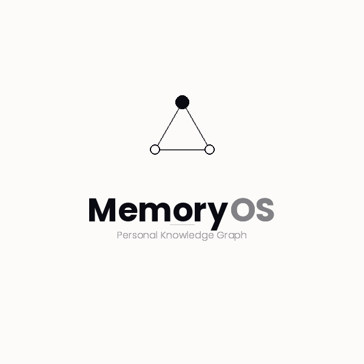

<p align="center">
  
</p>

# MemoryOS-2: Enterprise Memory Layer for AI Agents 🧠🕸️

> **The Long-Term Memory Engine for Autonomous Agentic Workflows.**

In 2026, every enterprise is deploying long-running autonomous AI agents. The biggest barrier holding these agents back is **memory loss**, **contextual drift**, and **extreme token costs**. MemoryOS-2 is an open-source solution designed to provide agents with a reliable, high-scale, and cost-effective memory layer.

By combining **Relational Ground Truth**, **Graph Taxonomy**, and **Abstract Vector Indexes**, agents can query millions of enterprise documents via the **Model Context Protocol (MCP)** for a fraction of the cost of traditional, brute-force RAG systems.

---

## 🚀 Enterprise-Grade Features

### 1. Tiered Memory Architecture
MemoryOS-2 solves the "Vector Bloat" problem by slicing data into logical tiers:
- **Relational Ground Truth (SQL):** The immutable master source. Stores full markdown, text segments, and character pointers.
- **Abstract Vector Index:** Instead of storing raw text in the vector DB, we store **Dense Informational Summaries**. This reduces storage overhead by 80% while maintaining semantic precision.
- **High-Fidelity Knowledge Graph:** A specialized layer for complex entity relationships (People, Tech, Concepts). Nodes are anchored by the vector layer, enabling precise "Pattern-Matching to Structural-Traversing" retrieval.

### 2. Dual-Path Query Routing (Intent-Aware)
Autonomous agents often query for specific metadata or broad concepts. MemoryOS-2 detects intent and routes accordingly:
- **Sequential Filtering (Structural):** Queries like *"What were the project specs from last Tuesday?"* filter SQL metadata first. **SQL Guardrails** ensure sub-millisecond lookups even across millions of records.
- **Graph-Augmented Retrieval (Conceptual):** Uses high-relevance vector "anchors" to enter the graph for shallow, context-rich traversals (Depth 1-2), preventing hallucinations in complex reasoning tasks.

### 3. Agentic Virtual File System (VFS)
MemoryOS-2 exposes your data as a **VFS in PostgreSQL**. This allows agents to:
- `scan` and `ls` directories of notes.
- `grep` through raw document content via SQL.
- Trace memory provenance back to the exact character range in the ground truth.

---

## 🤖 AI Integration (MCP First)
MemoryOS-2 is built for agents. It natively supports the **Model Context Protocol (MCP)**, allowing any MCP-compliant assistant (Claude Code, Antigravity, etc.) to treat your enterprise data as an extension of its own context.

### Connecting an Assistant
1. **Build the MCP Server:**
   ```bash
   cd mcp-server && npm install && npm run build
   ```
2. **Configure your AI Client:**
   Add MemoryOS-2 to your `mcp-config.json`:
   ```json
   {
     "mcpServers": {
       "memoryos": {
         "command": "node",
         "args": ["/absolute/path/to/mcp-server/dist/index.js"]
       }
     }
   }
   ```
3. **Available Agent Tools:** `search_memory`, `graph_traverse`, `read_vfs_path`, and `query_relational`.

---

## 🛠️ Tech Stack

- **Relational:** PostgreSQL (SQL Ground Truth)
- **Vector:** `pgvector` (Abstract Indexes)
- **Graph:** Prisma-backed Recursive CTEs (Taxonomy)
- **Orchestration:** LangChain & FastAPI
- **Frontend:** Next.js 14 (Agent Health Dashboard & UMAP Visualization)

---

## 🚦 Getting Started

### 1. Prerequisites
- Node.js v18+, Python 3.10+, PostgreSQL with `pgvector`.

### 2. Quick Start
```bash
# Install and Setup
cd ai-service && pip install -r requirements.txt
cd ../frontend && npm install && npx prisma db push

# Start the Memory Engine
uvicorn main:app --reload --port 8000
```

---

## 📜 License
MIT License - 2026 MemoryOS Team.
